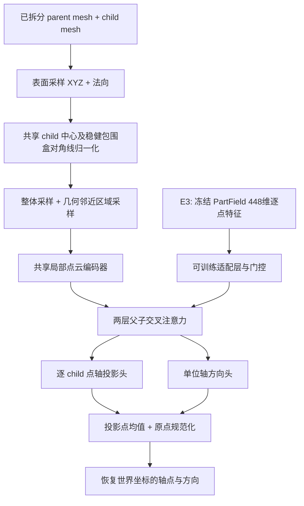

# 持续旋转关节轴：训练代码、策略、权重与实验归档

2026-10-03 从两台 AutoDL 归档。这里保存我们自己的连续旋转轴预测实验，包含 8 组全量训练、16 份 `best.pt/last.pt`、原始训练代码、冻结划分、逐轮日志、逐样本预测和诊断记录。原始服务器文件仍保留。

**这些是研究检查点，不是已经验证能可靠部署的模型。** 训练集能够充分拟合，但验证集泛化明显不足；最新或参数更多不代表效果更好。以下准确率均注明选用的检查点和评估划分，不能与整机分件模型论文中的数字直接比较。

## 1. 任务、输入与输出

- 已知父部件、子部件，且已经知道关节属于 `continuous`。
- 输入同一世界坐标系下的两组静态几何；mesh 经表面采样成为 XYZ＋单位法向点云。每个部件的缓存最多 8192 点，网络输入每件 2048 点。
- 输出单位方向 `d` 和轴上一点 `o`，构成 `o + t*d`。轴方向正负等价；原点沿轴平移等价。输出原点约定为轴上距 child 参考中心最近的点。
- 同一物体有多个 continuous 关节时，每条已知父子边各生成一个样本、独立预测。没有固定的整机部件槽位数。
- 不预测分件、父子拓扑、关节类型、运动上下限、转速或物理可行性。输入部件关系、单位和法向质量仍影响结果。

## 2. 数据与可复现身份

沿用本仓库 [continuous_axis_v2 冻结集合](../../benchmarks/continuous_axis_v2/README.md)：777 个资产/CAD 对，共 1550 条轴，训练 1234、验证 166、测试 150。排除的 8 条异常轴保持排除。划分按资产及既有家族/去重组隔离，不按关节随机重新划分。

训练来源为 Articraft、ArtVIP、Fusion、URDFfiles、自有 26 个物体。自有 continuous 轴分配为 33 train / 23 val / 9 test；没有把所有自有物体当作独立测试。一个物体的多根轴和同族变体不能当成同等数量的独立机械设计。

冻结快照 SHA256：`cd36c28ef0f9754fca9ec49cb60e29ad6aa0520c1af4b3003b011185228d4ace`。

`archive/*/MANIFEST.json` 是直接在 AutoDL 生成的逐文件大小、SHA256、来源路径清单。归档源码不修改，历史绝对路径仅用于追溯；迁移路径的工具放在归档目录外。原始标签来自不同来源，不等于全部经过人工或物理验证。

## 3. 网络结构



A 是整体原点直接回归；B 改为逐点投影；C/D/E 系列加入多尺度和邻近加密。父子保持同一坐标系，不能分别居中。child 坐标 0.5%/99.5% 分位数包围盒中心及对角线用于归一化。

C/E 的几何编码器宽度 128、64 个 anchor、24/96 点双邻域，两层、四头交叉注意力。全局 FPS 与邻近区域 FPS 混合；距离、最近表面偏移、法向关系来自几何，不读取关节标签。保留至少一半整体采样，接触面不可靠时仍有整体信息。它是直接神经网络预测，不是先产生几根候选轴再评分。

参数量：A 773,510；B 823,174；C/D/E0/E1/E2 915,846；E3 990,727。E3 数字只包括轴网络与特征适配层，**不含冻结的外部 PartField 编码器**。

## 4. 实验策略和损失的演变

| 实验 | 主要差别 | 训练设置 |
|---|---|---|
| A_direct | 全局直接回归原点和方向 | 150 epochs，batch 8 |
| B_projection | 方向＋逐点轴投影 | 同 A |
| C_multiscale | B＋多尺度、邻近采样 | 同 A |
| D_motion | C＋解析刚体旋转辅助损失 | 同 A |
| E0 CPU 全量 | C 网络，自由投影＋弦距离损失，无增强/正则 | 120 epochs，effective batch 4，micro batch 2 |
| E1 | E0＋dropout 0.05、weight decay 1e-4 | 120 epochs，batch/micro batch 4 |
| E2 | E1＋4 个固定旋转（包含恒等旋转）循环 | 同 E1 |
| E3 | E2＋冻结 PartField 特征及可训练融合层 | 同 E1 |

### 原始 A–D 损失

`L = (1-(d·g)^2) + 10*Huber(o-o_gt) + L_projection + 0.1*L_line + w_motion*L_motion`。

原点均先规范化；Huber 作用于向量范数，beta=0.05。B/C/D 有逐点投影及最终轴共线损失，A 没有这两项。D 的运动项权重 0.1，其余为 0；用 45°、90° 解析旋转比较对应点，并对一个样本的全部点和角度统一选择方向符号，不是无对应 Chamfer。

训练采用 AdamW、lr 3e-4、weight decay 0.01、dropout 0.1、梯度裁剪 1、混合精度；每轮按原训练采样器采样 2048 条，而非每条只看一次。几何和标签同步旋转，jitter=0.001，normal dropout=0.1。精确配置及调度器见每组 `run_config.json` 和原始 `train.py`。

### CPU 诊断与 E0–E3 简化损失

100 样本诊断比较 baseline / free_sin2 / free_chordal，随后全量 1234 训练样本测试采用 `free_chordal`。网络 C 没有缩小，改的是监督方式和投影头输出的使用方式。

对真实单位方向 `g`，令 `g'=sign(d·g)*g`；逐 child 点 `x_i`，真实投影 `q_i*=o_gt+((x_i-o_gt)·g)g`：

`L_direction = mean ||d-g'||²`

`q_i = x_i + projection_head_i`

`L_projection = mean Huber(||q_i-q_i*||, beta=0.05)`

`L = L_direction + L_projection`，两项权重均为 1。

此版本通过 hook 取投影头的原始偏移，绕过旧 forward 中的方向耦合约束。位置由 `canonical_origin(mean(q_i), d)` 计算。因此只加载权重后直接调用旧 `model.forward` 会产生不同的位置结果。这里的 [predict_pair.py](predict_pair.py) 已处理两种格式。历史 `identity.config.loss` 仍含原始配置，**E0–E3 实際生效的损失以 `cpu_full.py:loss_fn` 为准**。

E0–E3 采用 AdamW lr=3e-4、余弦衰减至 3e-5、梯度裁剪 1、float32；每条训练样本每轮恰好一次，309 次更新/轮，120 轮 37,080 次更新。无 jitter 和法向 dropout。训练随机种子 20260923；数据配置种子 20260911。E2/E3 是 4 个确定性 SO(3) 朝向循环，不是每步随机采无限朝向。

每 25 次更新记录 batch loss，逐轮记录平均 loss；E0–E3 每 5 轮评估 train/val。最佳权重按验证集 `macro_source_group(angle/5 + offset/0.01)` 最低值选择，**不是按严格达标率最高值选择**。最终训练集和验证集统计均使用评估模式，禁止用 test 选权重。

## 5. 指标与结果

- 方向误差：`atan2(||d×g||, abs(d·g))`，单位度，范围 0–90°。
- 位置误差：规范化预测原点到真值轴的垂直距离，除以 child 稳健包围盒对角线。表中的位置百分比是该无量纲值乘 100。
- 严格达标：方向 ≤5° **且** 位置 ≤1%；宽松达标：方向 ≤10° **且** 位置 ≤2%。
- 方向 ≤10° 单项成功率不约束位置，不能当作完整轴的正确率。
- 世界单位距离也保留为 `origin_to_axis_m`，仅在源资产单位可信时可乘 100 转 cm。
- `canonical_origin_normalized` 是两个规范化原点的欧氏距离，与点到轴距离不同。
- `motion_error_normalized` 是 45°/90° 对应点运动误差，除以 child 尺度。
- UniPhysGen 对齐位置指标使用实际保存的完整物体 AABB 最大半边长归一化，直接计算保存的预测点到真实轴距离，不额外规范化预测点；Fusion 的 CAD-pair 上下文另行分组。它不是厘米。来源帧及实现保存在 `metric_addon` 和 `uniphys_metrics`。这里只预测已知 continuous，不能对标同时预测关节类型的论文总体成绩。

完整数值、不同来源和 best/last 对照见 [RESULTS.md](RESULTS.md)。以下是最终 epoch=120 的 **166 条验证样本**，不是 150 条独立测试集：

| 模型 | 平均方向误差 | 平均位置误差/child | 方向≤10° | 严格达标 | 宽松达标 |
|---|---:|---:|---:|---:|---:|
| E1 | 25.65° | 6.18% | 99/166（59.64%） | 24/166（14.46%） | 47/166（28.31%） |
| E2 | 27.16° | 5.94% | 90/166（54.22%） | 10/166（6.02%） | 25/166（15.06%） |
| E3 | 34.39° | 6.41% | 70/166（42.17%） | 3/166（1.81%） | 18/166（10.84%） |

CPU E0 最终训练集严格达标 1217/1234（98.62%），验证集 25/166（15.06%）。这说明小样本/训练拟合问题与泛化问题应分开判断；不能仅靠继续加 epoch 解决验证集差距。当前 E3 融合方案没有带来收益，不能据此断言所有预训练几何特征无效。

## 6. 文件与权重索引

| 实验 | 目录（相对于本目录） | best 所在轮次 |
|---|---|---:|
| A | `archive/history_20260914_23/formal_20260914/runs/A_direct` | 78 |
| B | `archive/history_20260914_23/formal_20260914/runs/B_projection` | 135 |
| C | `archive/history_20260914_23/formal_20260914/runs/C_multiscale` | 139 |
| D | `archive/history_20260914_23/formal_20260914/runs/D_motion` | 140 |
| E0 | `archive/history_20260914_23/diagnostics_20260923/cpufull_chordal_accum_run120` | 65 |
| E1 | `archive/generalization_20260924/experiments/E1_run120` | 65 |
| E2 | `archive/generalization_20260924/experiments/E2_run120` | 105 |
| E3 | `archive/generalization_20260924/experiments/E3_run120` | 85 |

各目录含 `best.pt`、`last.pt`。检查点包含网络、优化器、调度器及配置/identity；A–D 内部 epoch 从 0 计，最终 149 表示训练完成 150 轮；E 系列按 1–120 计。`best` 和 `last` 不可混淆。

代码位置：A–D 为 `archive/history_20260914_23/formal_20260914/*.py`；E0 的诊断入口在同历史目录下 `diagnostics_20260923/cpu_full.py`；E1–E3 入口为 `archive/generalization_20260924/experiments/cpu_full.py`，基础模型在其 `source/`。CPU100 是诊断记录，不冒充另一份生产检查点。

## 7. 下载、环境和校验

从仓库根目录执行。代码、日志、配置为普通 Git 文件；`.pt` 使用 Git LFS。按目录下载可避免拉取整个资产库：

```bash
GIT_LFS_SKIP_SMUDGE=1 git clone https://github.com/YoungSkywalkerPadawan/urdfAsset.git
cd urdfAsset
git lfs install
git lfs pull --include='training/continuous_axis_v2/**/*.pt' --exclude=''
python training/continuous_axis_v2/verify_archive.py

python -m venv .venv
source .venv/bin/activate
pip install torch==2.8.0 --index-url https://download.pytorch.org/whl/cu128
pip install -r training/continuous_axis_v2/requirements.txt
```

推荐复现系统 Linux / Python 3.11，历史 GPU 为 24GB RTX 4090。CPU 可改为 PyTorch CPU wheel；原始训练脚本使用 Linux `posix_fadvise`，不能直接承诺在 Windows 上训练。`environment.freeze.txt` 是服务器环境取证，包含本地 wheel 路径和其他实验依赖，不能直接当成可移植 requirements 安装。

## 8. 使用权重推理

`predict_pair.py` 接受 NPZ 两个数组 `parent`、`child`，各为 `[N,6]`，前三列世界坐标（米）、后三列法向；不含真值轴。两个部件必须已经正确对齐。可从本仓库资产点云拼接 XYZ/法向，或从 GLB 按节点分组后表面采样；注意应用 mesh 节点世界变换。

```bash
ROOT=training/continuous_axis_v2
CKPT=$ROOT/archive/generalization_20260924/experiments/E1_run120/best.pt
python $ROOT/predict_pair.py --checkpoint "$CKPT" --verify-only
python $ROOT/predict_pair.py --checkpoint "$CKPT" \
  --input /data/pair.npz --output /data/prediction.json --device cpu
```

输出 `origin_world_m`、`direction_world`、child 参考中心/尺度、种子和权重 SHA256。该入口检查权重格式、严格加载参数、检查有限值，处理 free_chordal 的特殊位置解码。它是应用示例，新的采样种子/点池会影响结果，不能拿它替代冻结样本评测。E3 必须配套准确对齐的 PartField 特征，普通 NPZ 入口会明确拒绝，避免悄悄丢掉特征分支。

原 A–D 的 `infer_glb.py` 支持 `--list-parts` 和 `--pairs` 指定 parent/child 节点组；该原入口不兼容 E0–E3 检查点格式。

## 9. 重建缓存与重新训练

避免重复存储约 693MB NPY 点缓存：仓库已有资产 NPZ，可按原始算法重建，逐个校验 SHA256。先按需取回 `datasets/*/assets/*/inputs/*.npz` 的 LFS 内容及相关 asset.json。脚本不访问外网，不改变任何划分，不修改原始资产。

```bash
git lfs pull --include='datasets/*/assets/*/inputs/*.npz' --exclude=''
python training/continuous_axis_v2/restore_cache.py --repo . --output /data/axis-cache
python training/continuous_axis_v2/run_relocated.py --experiment E1 \
  --cache-root /data/axis-cache --output /data/new-E1 --device cuda
```

`--experiment E0/E1/E2` 选择策略；`--smoke-steps 1` 可检查入口。工具只重写副本中的机器路径，保留代码哈希及冻结索引。E0 采用微批次 2、E1/E2 为 4；这是一轮新的重跑，不伪装成历史训练恢复。未授权时不要启动它。

若 NPZ 或生成结果哈希不同，工具中止；不要删除哈希检查来勉强复现。可改用原 AutoDL 的 `/root/autodl-tmp/continuous-axis-training-v1-20260911/prepared` 冻结缓存。恢复历史训练需使用对应代码、原 config/identity、同一总轮数和同一输出目录；E 系列以 `--resume` 恢复自身 last.pt，已完成的 120 轮不是自动延长训练。改轮数/采样/路径形成新实验，记录新身份。

A–D 重跑使用各自 `run_config.json` 内 `config` 另存为 JSON，改 `prepared_dir/cache_root/run_dir` 后调用原 `train.py --config ... --device cuda`。原始启动脚本和 configs 全部保留，历史绝对路径需先检查，不能在其他容器原样盲跑。

### E3 的额外依赖

E3 的 PartField 编码器冻结，先离线提取父子拼接几何的 448 维特征（fp16），每次训练前校验点坐标 query hash，融合层负责学习。`extract_partfield.py`、`geometry_features.py`、对齐检查脚本和 [partfield_provenance.json](partfield_provenance.json) 均保留。

外部预训练文件为 `model_objaverse.ckpt`，SHA256 `463efc8a3afd3913142aa025e0125c00f16ef452b8de6a132ebe32bbe7877ee4`；它不是我们训练产生的权重。本次不重复发布该第三方文件，也不复制约 17GB 可重建特征缓存。需按原 Instruct-Particulate / PartField 安装依赖和许可取得该文件，配套适配器后运行提取脚本。迁移 metadata 路径会改变哈希，需重新生成匹配的缓存；不能手改 manifest 伪造一致。

## 10. 限制与后续使用

优先将本归档作为可追溯基线：检查失败样本、单位、法向、父子归属和家族重复；按来源分别评估；区分方向不准与轴位置偏移；再验证预训练特征对齐和融合方法。不能因为训练 loss 低就把权重用于自动生成可靠 URDF。

本次没有启动新训练，没有重算整套 1550 条测试，也没有恢复暂停中的数据采集。迁移校验覆盖文件哈希、权重严格加载及有限值；详细记录见 `MIGRATION.json`。原资产和第三方代码/权重各自的许可继续适用，不能因放入同一仓库就统一改成宽松许可。
